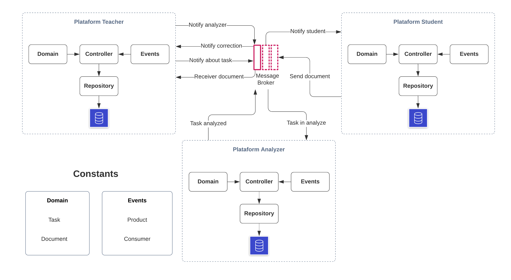

# LYRA

	No mundo existem dois tipos de pessoas, as que demoram pensando em um nome...
	E as pessoas que sentem se a vontades com nomes aleatorios. E Lyra é um deles.

Caso deseje acessar o
[arquivo original do trabalho](./assets/description.pdf)

## Tecnologias 
- Docker e Docker Compose
- Kotlin (Spring boot)
- Kafka
- Dart

## Definições
	O estilo de arquitetura implementado no sistema é orientado a eventos e microserviço. 
	Foi escolhido a aborgadem de um sistema Coreógrafo. 
	Para definir os componentes do sistema foi submetido ao processo da Workflow.

### Dominio
- Atividade
	- Titulo
	- Descrição
	- Prazo final
	- Lista de documentos(Respostas)
	- Média

- Documento
	- Nome do estudante
	- Situação de plágio
	- Data de submissão
	- Nota

### Eventos
- Após o cadastro, enviar notificações sobre o trabalho para o aluno.
- Quando a correção estiver acabada, iniciar o processo de detecção de plágio.
	- Caso tenha sido detectado plágio anular o trabalho.
	- Caso não, será corrigido e estabelecido o resultado.
- Criar relatório ao final da correção.
- Enviar notificação de submissão, quando o aluno enviar o trabalho.

### Micro serviços e suas responsabilidades
- Professor
	- Criar tarefa
	- Enviar notificação de tarefa cadastrada para o aluno
	- Receber relatorio

- Aluno
	- Enviar resposta
	- Receber notificação de tarefa cadastrada para o aluno

- Analisador
	- Correção das atividades
	- Notificar

- Teste (Opcional)
	- Criar atividades e respondê-las.

### Virtualização
	Foi criado imagens personalizadas para cada serviço que estão descritas em dockerfile 
	e temos um docker-compose que iria gerenciar tudo isso.

### Como usar?
	Para facilitar foi criado um make que faz tudo para você!
	Basta digita "make up", ou então, caso queira ver mais possibilidades make help.
	Caso realize mudança no cod fonte dos serviços deverá então ser novamente
	gerado o binário. Caso seja computados permita tente realizar um "make run".

### O Workspace para testes
	O workspace Insomnia foi colocado internamente no projeto, nas pasta de assets, 
	caso queira testar basta importar.
 
 ### Comunidade
	Caso alguém se interesse em realizar melhorias, basta abrir uma "issue" ou então 
	dá um "fork" e manda a "PR" pro pai.
